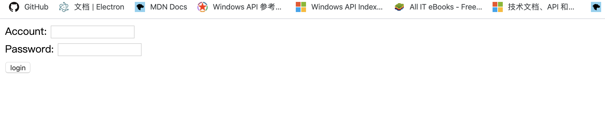

## restful jwt

首先需要两个 docker 镜像。

``` shell
docker pull luckyle/repo:nginx-jwt-web
```

或者执行 `docker-compose up`，在本地生成一个 nginx 服务。

``` shell
docker pull luckyle/repo:mysql
```

然后运行 main.go。

最后在浏览器中输入`localhost`，即可看到 web 客户端页面。



mysql 中默认有一个用户，用户名为 luskyle, 密码为 root.若口令正确，则返回一个欢迎页面。


Header 中返回一个 key 值为 your_token 的 token


若口令不正确，则返回一个登录失败页面


3 秒钟后返回登录界面

